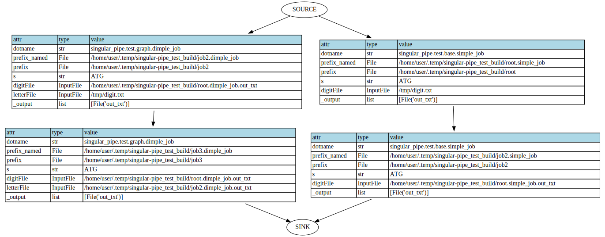

[](https://travis-ci.com/shouldsee/singular_pipe)

## singular_pipe: Utilities to make a pipeline, with singularity integration and caching ability.

### Dependencies:

- A pip manager compatible with PEP 508 URL requirements see [examples](https://www.python.org/dev/peps/pep-0508/#examples):
  - For python3, this means `python3 -m pip install --upgrade pip>=18.1` (see pip3 [changelog](https://pip.pypa.io/en/stable/news/#id245))
  - For python2, err python2 is not yet supported 
- Optional: singularity >= 3.5.3 to use `singular_pipe.types.LoggedSingularityExecCommand()`. (try to install with `bash install_singular.sh /opt/singularity`, assuming ubuntu and use sudo for apt packages)
- Optional: dot binary for plotting graphs with `singular_pipe.graph.plot_simple_graph()`.(try install with `sudo apt install -y graphviz`)
- see requirements.txt

### Install

```bash
pip3 install singular_pipe@https://github.com/shouldsee/singular_pipe/tarball/master --user
```

### Documentation

See https://shouldsee.github.io/singular_pipe/

### Screenshots




### Examples


`python3 examples/07_remote_short.py`

```python
'''
Since scripts are small, they can be uploaded to remote quickly
without pain
'''
from singular_pipe.types import Node,Flow
from singular_pipe.types import RemotePythonObject as RPO

package_path = 'singular_pipe_mock_flow@https://github.com/shouldsee/singular_pipe_mock_flow/tarball/d457426'
@Flow
def simple_flow(
	self,prefix,
	_main= RPO(package_path, None, 'run_and_backup'),
	_output=[]
 ):

	func = _main.loaded()
	self.runner( func,  prefix, 1, 20, prefix+'_backup')	
	
	return self

if __name__ == '__main__':
	from path import Path
	from singular_pipe.runner import get_changed_files,get_all_files,cache_run
	from pprint import pprint
	
	prefix = Path('/tmp/test_import/root')
	prefix.dirname().rmtree_p()

	fs = get_changed_files( simple_flow, prefix)
	pprint(fs)

	cache_run( simple_flow, prefix)

	fs = get_changed_files( simple_flow, prefix)
	pprint(fs)
```

`python3 examples/01_cache_run_shallow.py`

```python
'''
This script demo the principle of caching in this module
The basic element to be cached is a function evaluation tuple (func, prefix,*args),
which is considered as a Node whose status and last evaluation stored in its prefix. 

cache_run(func,prefix,*args) checks whether a node
needs to be updated according to its immediate upstream nodes/inputs.
'''
from path import Path
from singular_pipe.runner import cache_run, force_run
def simplest_node(self, prefix, _output=[]):
	print('Running node:%r'%self)
	return self ### This is the default behaviour for singular_pipe.runner.cache_run() 

if __name__ == '__main__':
	print('\n### running')
	prefix = Path('/tmp/bulid_singular_pipe/root')
	prefix.dirname().rmtree_p()
	cache_run(simplest_node, prefix )
	cache_run(simplest_node, prefix )
	print()

	s = '''
	### comment
	expect: 
	Running node:singular_pipe.runner.Caller(dotname='__main__.simplest_node',prefix_named=File('/tmp/bulid_singular_pipe/root.simplest_node'))
	Running node:singular_pipe.runner.Caller(dotname='__main__.simplest_node',prefix_named=File('/tmp/bulid_singular_pipe/root.simplest_node'))
	
	got:
	Running node:singular_pipe.runner.Caller(dotname='__main__.simplest_node',prefix_named=File('/tmp/bulid_singular_pipe/root.simplest_node'))

	The second run accessed cache
	'''
	print(s)
	pass


def less_simple_node( self, prefix, seq=str, _output=['txt']):
	with open(self.output.txt,'w') as f:
		print('writing %s to %r'%(seq,self.output.txt))
		f.write(seq * 10)
	return self

if __name__ == '__main__':
	print('\n### running')

	prefix = Path('/tmp/bulid_singular_pipe/root')
	prefix.dirname().rmtree_p()
	cache_run( less_simple_node, prefix, 'ATCG' )
	cache_run( less_simple_node, prefix, 'ATCG' )
	cache_run( less_simple_node, prefix, 'ATCG' )
	cache_run( less_simple_node, prefix, 'GCTA' )
	s = '''
	### comment
	expect:
	writing ATCG to File('/tmp/bulid_singular_pipe.less_simple_node.txt')
	writing ATCG to File('/tmp/bulid_singular_pipe.less_simple_node.txt')
	writing ATCG to File('/tmp/bulid_singular_pipe.less_simple_node.txt')
	writing GCTA to File('/tmp/bulid_singular_pipe.less_simple_node.txt')

	got:
	writing ATCG to File('/tmp/bulid_singular_pipe.less_simple_node.txt')
	writing GCTA to File('/tmp/bulid_singular_pipe.less_simple_node.txt')

	Becuase cache file is loaded for the two middle evaluations

	'''
	print(s.strip('\n'))
	pass

from singular_pipe.types import File,LoggedShellCommand

def make_tar( self, prefix, input_file=File, _output=['tar_gz'] ):
	with input_file.dirname() as d:
		print('taring %r'%d)
		stdout = LoggedShellCommand(['tar','-zvcf',self.output.tar_gz, '*'], '/dev/null')
	return self


if __name__ == '__main__':
	prefix = Path('/tmp/bulid_singular_pipe/root')
	prefix.dirname().rmtree_p()

	caller = cache_run(less_simple_node, prefix, 'ATCG')
	res0 = caller
	print('[res0.output.txt]:%r'%res0.output.txt)
	caller = cache_run(make_tar,         prefix, res0.output.txt)
	caller = cache_run(make_tar,         prefix, res0.output.txt)  #marked#


	caller = cache_run(less_simple_node, prefix, 'GATC')
	caller = cache_run(make_tar,         prefix, res0.output.txt)
	print('[done]')
	s = '''
	## got
	writing ATCG to File('/tmp/bulid_singular_pipe/root.less_simple_node.txt')
	[res0.output.txt]:File('/tmp/bulid_singular_pipe/root.less_simple_node.txt')
	taring File('/tmp/bulid_singular_pipe')
	writing GATC to File('/tmp/bulid_singular_pipe/root.less_simple_node.txt')
	taring File('/tmp/bulid_singular_pipe')
	[done]

	## Note make_tar() is detecting the change of res0.output.txt and skipped the #marked# evaluation
	'''
```

`python3 examples/03_mock_flow_backup.py`

```python
'''
Symbolic run construct .outward_edges, .input_json and .output_json as usual 
but skip the creation of actual output files.
A symbolic node is a node with all output_files being empty
'''
import singular_pipe
from singular_pipe.types  import Node,Flow
from singular_pipe.types  import Path, File, Prefix
from singular_pipe.types  import LoggedShellCommand
import random
def random_seq(self, prefix, seed = int, L = int, _output=['seq']):
	random.seed(seed)
	with open(self.output.seq,'w') as f:
		f.write('>random_sequence\n')
		buf = ''
		for i in range(L):
			buf += 'ATCG'[int(random.random()*4)]
		f.write(buf+'\n')
	return self


def transcribe(self, prefix, input = File, _output=['fasta']):
	with open(input,'r') as fi:
		with open(self.output.fasta,'w') as fo:
			fo.write(fi.read().replace('T','U'))
	return self

def mutate(self, prefix, input=File,   _seed = 0, _output=['fasta']):
	random.seed(_seed)
	with open(input,'r') as fi:
		with open(self.output.fasta,'w') as fo:
			buf = list(fi.read())
			random.shuffle(buf)
			fo.write(''.join(buf))
	return self


@Flow
def workflow(self, prefix, seed =int , L=int, 
	_output = [
	File('log'),
	]):
	print('\n[Flow running] mock=%s'%getattr(self.runner.func,'__name__','None'))
	curr = self.runner(random_seq, prefix,  seed,  L)
	curr1 = self.config_runner(tag='const')(random_seq, prefix, 0, 100)
	curr = self.runner(transcribe, prefix,  curr.output.seq,)
	curr = self.runner(mutate,     prefix,  curr.output.fasta)
	stdout = LoggedShellCommand(['ls -lhtr',prefix.dirname()], self.output.log).rstrip()
	self.runner(copy_file, prefix+'.source.py', __file__)
	return self


from singular_pipe.types import Caller, rgetattr
import shutil
def copy_file(self, prefix, input=File, 
	_single_file = 1, ### A single file node only tracks the file at self.prefix
	_output=[], 
	):
	'''
	#### One can also use directly move the output file, but this would break the upstream integrity 
	#### and is hence not recommended
	'''
	shutil.copy2(input, self.prefix+'.temp')
	shutil.move(self.prefix +'.temp', self.prefix)

@Flow
def backup(self, prefix, flow = Caller, _output=[]):
	key = 'subflow.random_seq.output.seq'
	self.runner(copy_file, prefix+'.' + key, rgetattr(flow,key))
	key = 'subflow.random_seq_const.output.seq'
	self.runner(copy_file, prefix+'.' + key, rgetattr(flow,key))
	key = 'subflow.transcribe.output.fasta'
	self.runner(copy_file, prefix+'.' + key, rgetattr(flow,key))
	key = 'subflow.mutate.output.fasta'
	self.runner(copy_file, prefix+'.' + key, rgetattr(flow,key))
	key = 'output.log'
	self.runner(copy_file, prefix+'.' + key, rgetattr(flow,key))

	self.runner(copy_file, prefix+'.source.py',__file__)
	return self


from singular_pipe.graph import tree_call, get_downstream_tree, get_upstream_tree, plot_simple_graph_lr
from graphviz import Digraph
import json
def plot_graph(self, prefix, backup_result=Caller, _output=['deptree_json','deptree_dot_txt']):
	fs   = backup_result.get_all_files()
	tree = get_upstream_tree(fs, 0)
	with open( self.output.deptree_json, 'w') as f:
		json.dump(tree_call(repr,tree),f,default=repr,indent=2)
	g = plot_simple_graph_lr(fs, None, 0, 1)
	fname = g.render( self.output.deptree_dot_txt ,format='svg' )
	print('[fn]',fname)

@Flow
def run_and_backup(
	self, prefix,
	seed = int , L = int, 
	backup_prefix=File, ### we don't want to track backup_prefix
	_output = [
	# File('log'),
	]):
	
	#### execute the flow
	flow          = self.runner(workflow, prefix, seed, L)

	#### perform backup
	backup_result = self.runner(backup, backup_prefix, flow)

	#### plot a dependency graph into the backup directory
	graph_out     = self.runner(plot_graph, backup_prefix, backup_result)

	return self


def main(self=None,
	prefix = None):
	from singular_pipe.runner import cache_run, mock_run, get_changed_files, get_all_files
	from singular_pipe.shell import LoggedShellCommand
	from singular_pipe.types import File,CacheFile
	from pprint import pprint
	singular_pipe.rcParams['dir_layout']='clean'

	# if prefix is None:
	prefix = Path('/tmp/singular_pipe.symbolic/root')
	# backup_prefix = File('/home/user/.temp/backup_03_mock_flow/root')
	backup_prefix = File('~/.temp/backup_03_mock_flow/root').expand()
	prefix.dirname().rmtree_p()
	backup_prefix.dirname().rmtree_p()	

	print('\n...[start]%r'%prefix)


	#### once a workflow is defined, we can view the proposed file changes 
	fs = get_changed_files(workflow, prefix, 1, 100, verbose=0)
	pprint(fs)
	assert fs ==[
 File('/tmp/singular_pipe.symbolic/root.workflow.log'),
 File('/tmp/singular_pipe.symbolic/root.random_seq.seq'),
 File('/tmp/singular_pipe.symbolic/root.random_seq_const.seq'),
 File('/tmp/singular_pipe.symbolic/root.transcribe.fasta'),
 File('/tmp/singular_pipe.symbolic/root.mutate.fasta'),
 File('/tmp/singular_pipe.symbolic/root.source.py'),

 # File('/home/user/.temp/backup_03_mock_flow/root.source.py')
 ]

	### backup is conveniently defined as a workflow taking an executed workflow as an input.
	### To check the proposed backup, mock_run() the workflow first. 
	workflow_out = mock_run(workflow, prefix, 1, 100)	
	fs = get_changed_files(backup, backup_prefix, workflow_out)
	pprint(fs)
	assert fs == [
 File('/home/user/.temp/backup_03_mock_flow/root.subflow.random_seq.output.seq'),
 File('/home/user/.temp/backup_03_mock_flow/root.subflow.random_seq_const.output.seq'),
 File('/home/user/.temp/backup_03_mock_flow/root.subflow.transcribe.output.fasta'),
 File('/home/user/.temp/backup_03_mock_flow/root.subflow.mutate.output.fasta'),
 File('/home/user/.temp/backup_03_mock_flow/root.output.log'),
 # File('/tmp/singular_pipe.symbolic/root.source.py')
 File('/home/user/.temp/backup_03_mock_flow/root.source.py')
]


	### a convenient Flow may be defined to execute the two in chain
	### If there is certain change to the workflow,
	### the backup can also be runned
	fs = get_changed_files (run_and_backup, prefix, 1, 100, backup_prefix, verbose=0)
	pprint(fs)
	assert fs == [
	File('/tmp/singular_pipe.symbolic/root.workflow.log'),
 File('/tmp/singular_pipe.symbolic/root.random_seq.seq'),
 File('/tmp/singular_pipe.symbolic/root.random_seq_const.seq'),
 File('/tmp/singular_pipe.symbolic/root.transcribe.fasta'),
 File('/tmp/singular_pipe.symbolic/root.mutate.fasta'),
 File('/tmp/singular_pipe.symbolic/root.source.py'),
 File('/home/user/.temp/backup_03_mock_flow/root.subflow.random_seq.output.seq'),
 File('/home/user/.temp/backup_03_mock_flow/root.subflow.random_seq_const.output.seq'),
 File('/home/user/.temp/backup_03_mock_flow/root.subflow.transcribe.output.fasta'),
 File('/home/user/.temp/backup_03_mock_flow/root.subflow.mutate.output.fasta'),
 File('/home/user/.temp/backup_03_mock_flow/root.output.log'),
 File('/home/user/.temp/backup_03_mock_flow/root.source.py'),

 File('/home/user/.temp/backup_03_mock_flow/root.plot_graph.deptree_json'),
 File('/home/user/.temp/backup_03_mock_flow/root.plot_graph.deptree_dot_txt'), 

 ]

	###### constants that are preserved between runs should be detected unchanged
	_  = cache_run         (run_and_backup,  prefix, 1, 100, backup_prefix, verbose=0)
	fs = get_changed_files (run_and_backup,  prefix, 2, 200, backup_prefix, verbose=0)
	pprint(fs)
	assert fs == [File('/tmp/singular_pipe.symbolic/root.workflow.log'),
 File('/tmp/singular_pipe.symbolic/root.random_seq.seq'),
 # File('/tmp/singular_pipe.symbolic/root.random_seq_const.seq'),
 File('/tmp/singular_pipe.symbolic/root.transcribe.fasta'),
 File('/tmp/singular_pipe.symbolic/root.mutate.fasta'),
 # File('/tmp/singular_pipe.symbolic/root.source.py'),	
 File('/home/user/.temp/backup_03_mock_flow/root.subflow.random_seq.output.seq'),
 # File('/home/user/.temp/backup_03_mock_flow/root.subflow.random_seq_const.output.seq'),
 File('/home/user/.temp/backup_03_mock_flow/root.subflow.transcribe.output.fasta'),
 File('/home/user/.temp/backup_03_mock_flow/root.subflow.mutate.output.fasta'),
 File('/home/user/.temp/backup_03_mock_flow/root.output.log'),
 # File('/home/user/.temp/backup_03_mock_flow/root.source.py'),
 File('/home/user/.temp/backup_03_mock_flow/root.plot_graph.deptree_json'),
 File('/home/user/.temp/backup_03_mock_flow/root.plot_graph.deptree_dot_txt'), 
	 ]
	##### get_all_files() return a leaf file regardless of whether is is changed
	fs = get_all_files     (run_and_backup,  prefix, 2, 200, backup_prefix, verbose=0)
	pprint(fs)
	assert fs == [
 File('/tmp/singular_pipe.symbolic/root.workflow.log'),
 File('/tmp/singular_pipe.symbolic/root.random_seq.seq'),
 File('/tmp/singular_pipe.symbolic/root.random_seq_const.seq'),
 File('/tmp/singular_pipe.symbolic/root.transcribe.fasta'),
 File('/tmp/singular_pipe.symbolic/root.mutate.fasta'),
 File('/tmp/singular_pipe.symbolic/root.source.py'),
 File('/home/user/.temp/backup_03_mock_flow/root.subflow.random_seq.output.seq'),
 File('/home/user/.temp/backup_03_mock_flow/root.subflow.random_seq_const.output.seq'),
 File('/home/user/.temp/backup_03_mock_flow/root.subflow.transcribe.output.fasta'),
 File('/home/user/.temp/backup_03_mock_flow/root.subflow.mutate.output.fasta'),
 File('/home/user/.temp/backup_03_mock_flow/root.output.log'),
 File('/home/user/.temp/backup_03_mock_flow/root.source.py'),
 File('/home/user/.temp/backup_03_mock_flow/root.plot_graph.deptree_json'),
 File('/home/user/.temp/backup_03_mock_flow/root.plot_graph.deptree_dot_txt'), 
 ]
	_  = cache_run         (run_and_backup,  prefix, 2, 200, backup_prefix, verbose=0)


if __name__ == '__main__':
	main(None,None)

```


### ToDo
    - [x] Running a remote module
    	- [ ] add some tests for singular_pipe._types.PythonModule()
    - [ ] Polish graph to have input-output node
    - [ ] Ability to relocate nodes.
    - [ ] Auto-backup all output files. job_backup_copy()
    - [ ] (not essential) Adding Glob() and RecursiveGlob() to allow for easy file matching
	- [x] (see config_runner(tag=DirtyKey('Some tag')))(func, prefix) must be unique within each workflow
    - [ ] Add timed_run() to print out execution times for each job.
    - [x] Added MyPickleSession to sniff python dependency. Use protocol 3 by default
    - [ ] adds error tests for Caller.cache and Caller.__call__
    - [ ] cache_run_deep() to compute a dynamic graph and recursively 
        cache_run() from top to bottom.
    - [x] (see `mock_run()`) Caller.method() to populate Caller.output() for constructing symbolic graphs.
	- [x] In get_upstream()/get_downstream(), how to treat File that belongs to a Prefix?
		- [x] it should come with a pointer pointing back to the Prefix.
		- Prefix in get_input_identity() will be globbed and snapshotted
		- Prefix in get_upstream() will be treated as a standalone
		- If a File has been included in a OutputPrefix(), 
	- [x] fix get_upstream() if possible 
	- [x] test_loadable_subprocess() test the outputted caller_dump is loadable from other directories
	- shellcmd
		- [x] capture stderr and stdout of subprocess.check_output(), 
		- [x] logging the command executed into .cmd file
		- [x] with optional log file.  
	- [x] adding an outward_pk file to complement input_pk and auto-sync
		- the outward_pk should record identity of the output file and input file.
		- the input_ident is useful 
	- [x] produce a dependency graph
		- get_upstream_files()
		- get_downstream_nodes()
	- [x] (Done as HttpResponse(),  ) Adding InputHTTP() 
		- [ ] better subclassing requests.Request()?
	- [ ] implements version_check when reading input_json / output_json
	- [ ] Adding OutputHTTP() object 
	- [ ] (abandoned)import module from online.
	- [ ] migrate valid cache folder and preserving inner dependency and re-connect cutted dependency
	- [ ] implementing checks for output nodes to make sure Files.to_ident() are changed
