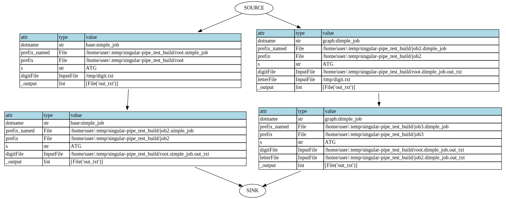

[](https://travis-ci.com/shouldsee/python-singular-pipe)

## singular_pipe: Utilities to make a pipeline, with singularity integration and caching ability.

### Dependencies:

- Optional: singularity >= 3.5.3 to use singular_pipe.base.singularity_run(). (try to install with `bash install_singular.sh /opt/singularity`, assuming ubuntu and use sudo for apt packages)
- Optional: dot binary for plotting DAG.(try install with `sudo apt install -y graphviz`)
- see requirements.txt

### Install

```bash
pip3 install singular_pipe@https://github.com/shouldsee/python-singular-pipe/tarball/master --user
```

### Screenshots




### Documentation

Formal documentation is not yet available. Please see Examples

### Examples


`python3 examples/cache_run_shallow_01.py`

```python
'''
This script demo the principle of caching in this module
The basic element to be cached is a function evaluation tuple (func, prefix,*args),
which is considered as a Node whose status and last evaluation stored in its prefix. 

cache_run(func,prefix,*args) checks whether a node
needs to be updated according to its immediate upstream nodes/inputs.
'''
from path import Path
from singular_pipe.runner import cache_run, force_run
def simplest_node(self, prefix, _output=[]):
	print('Running node:%r'%self)
	return self ### return Runtime Caller as output is beneficial

if __name__ == '__main__':
	print('\n### running')
	prefix = Path('/tmp/bulid_singular_pipe/root')
	prefix.dirname().rmtree_p()
	cache_run(simplest_node, prefix )
	cache_run(simplest_node, prefix )
	print()

	s = '''
	### comment
	expect: 
	Running node:singular_pipe.runner.Caller(dotname='__main__.simplest_node',prefix_named=File('/tmp/bulid_singular_pipe/root.simplest_node'))
	Running node:singular_pipe.runner.Caller(dotname='__main__.simplest_node',prefix_named=File('/tmp/bulid_singular_pipe/root.simplest_node'))
	
	got:
	Running node:singular_pipe.runner.Caller(dotname='__main__.simplest_node',prefix_named=File('/tmp/bulid_singular_pipe/root.simplest_node'))

	The second run accessed cache
	'''
	print(s)
	pass


def less_simple_node( self, prefix, seq=str, _output=['txt']):
	with open(self.output.txt,'w') as f:
		print('writing %s to %r'%(seq,self.output.txt))
		f.write(seq * 10)
	return self

if __name__ == '__main__':
	print('\n### running')

	prefix = Path('/tmp/bulid_singular_pipe/root')
	prefix.dirname().rmtree_p()
	cache_run( less_simple_node, prefix, 'ATCG' )
	cache_run( less_simple_node, prefix, 'ATCG' )
	cache_run( less_simple_node, prefix, 'ATCG' )
	cache_run( less_simple_node, prefix, 'GCTA' )
	s = '''
	### comment
	expect:
	writing ATCG to File('/tmp/bulid_singular_pipe.less_simple_node.txt')
	writing ATCG to File('/tmp/bulid_singular_pipe.less_simple_node.txt')
	writing ATCG to File('/tmp/bulid_singular_pipe.less_simple_node.txt')
	writing GCTA to File('/tmp/bulid_singular_pipe.less_simple_node.txt')

	got:
	writing ATCG to File('/tmp/bulid_singular_pipe.less_simple_node.txt')
	writing GCTA to File('/tmp/bulid_singular_pipe.less_simple_node.txt')

	Becuase cache file is loaded for the two middle evaluations

	'''
	print(s.strip('\n'))
	pass

from singular_pipe.types import File
from singular_pipe.shell import LoggedShellCommand
def make_tar( self, prefix, input_file=File, _output=['tar_gz'] ):
	with input_file.dirname() as d:
		print('taring %r'%d)
		stdout = LoggedShellCommand(['tar','-zvcf',self.output.tar_gz, '*'], '/dev/null')
	return self


if __name__ == '__main__':
	prefix = Path('/tmp/bulid_singular_pipe/root')
	prefix.dirname().rmtree_p()

	caller = cache_run(less_simple_node, prefix, 'ATCG')
	res0 = caller
	print('[res0.output.txt]:%r'%res0.output.txt)
	caller = cache_run(make_tar,         prefix, res0.output.txt)
	caller = cache_run(make_tar,         prefix, res0.output.txt)  #marked#


	caller = cache_run(less_simple_node, prefix, 'GATC')
	caller = cache_run(make_tar,         prefix, res0.output.txt)
	print('[done]')
	s = '''
	## got
	writing ATCG to File('/tmp/bulid_singular_pipe/root.less_simple_node.txt')
	[res0.output.txt]:File('/tmp/bulid_singular_pipe/root.less_simple_node.txt')
	taring File('/tmp/bulid_singular_pipe')
	writing GATC to File('/tmp/bulid_singular_pipe/root.less_simple_node.txt')
	taring File('/tmp/bulid_singular_pipe')
	[done]

	## Note make_tar() is detecting the change of res0.output.txt and skipped the #marked# evaluation
	'''```


### ToDo


    - [ ] In get_upstream()/get_downstream(), how to treat File that belongs to a Prefix?
        - [x] it should come with a pointer pointing back to the Prefix.
        - Prefix in get_input_identity() will be globbed and snapshotted
        - Prefix in get_upstream() will be treated as a standalone
        - If a File has been included in a OutputPrefix(), 
    - [ ] fix get_upstream() if possible 
    - [ ] Caller.method() to populate Caller.output() for constructing symbolic graphs.
    - [x] test_loadable_subprocess() test the outputted caller_dump is loadable from other directories
    - shellcmd
        - [x] capture stderr and stdout of subprocess.check_output(), 
        - [x] logging the command executed into .cmd file
        - [ ] with optional log file.  
    - [x] adding an outward_pk file to complement input_pk and auto-sync
        - the outward_pk should record identity of the output file and input file.
        - the input_ident is useful 
    - [x] produce a dependency graph
        - get_upstream_files()
        - get_downstream_nodes()
    - [x] (Done as HttpResponse(),  ) Adding InputHTTP() 
        - [ ] better subclassing requests.Request()?
    - [ ] implements version_check when reading input_json / output_json
    - [ ] Adding OutputHTTP() object 
    - [ ] (abandoned)import module from online.
    - [ ] migrate valid cache folder and preserving inner dependency and re-connect cutted dependency
    - [ ] implementing checks for output nodes to make sure Files.to_ident() are changed
